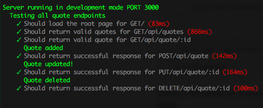

#Arnold Schwarzenegger movie quote API
RESTful API web service that delivers Arnold Schwarzenegger movie quotes, written in NodeJS using the Express framework.

###Before we start the API.
Start by downloading the project from git and setup your own MongoDB either locally or online.
Make sure to set your MongoDB uri to your MONGO_DB .env variable.
Also for testing set up an additional MongoDB for testing setting that uri to MONGO_TEST .env.
Make sure that you copy the content of the quotes_database.json file and insert it to your own MongoDB and keep the test MongoDB empty(no documents).

###How to start?
Now that we have set up our database it's time to start the API.
First make sure that you have NodeJS installed on your computer, if not do that first.

Then from the root folder of the project run this simple command in your terminal to install the packages needed for the project.
```
npm install
```
Now that we have our packages we start the API by running this command in the terminal.
```
npm start
```
There is now a server on localhost:8080 running the API.


This will set the running environment to development disconnecting from main database and connecting to test database.
```
npm run dev
```

This will set the running environment to development and test test all endpoints.
```
npm test
```



###Endpoints.
####GET /quotes
Returns the whole database of quotes.
```
GET /quotes
```
####GET /quotes/:id .
Returns the quote assigned to the ID specified. There is a total of a 100 quotes.
```
GET /quote/56
```
####POST /quote
Request body example, all fields are required.
```javascript
{
    "quote": " \"I'll be back.\"",
    "movie": "The Terminator",
    "character": "Terminator"
  }
```
####PUT /quote/:id
This works similar to POST with the difference that you apply and already existing _id rather than a new one.
This is perfect if you want to make changes to an already posted quote.

####DELETE /quote/:id
This completely removes the quote with the specified _id.

###Example
This site provides a small example of what can be achieved with this RESTful API.

[https://arnold-quotes-api.herokuapp.com](https://arnold-quotes-api.herokuapp.com)

###License
MIT
